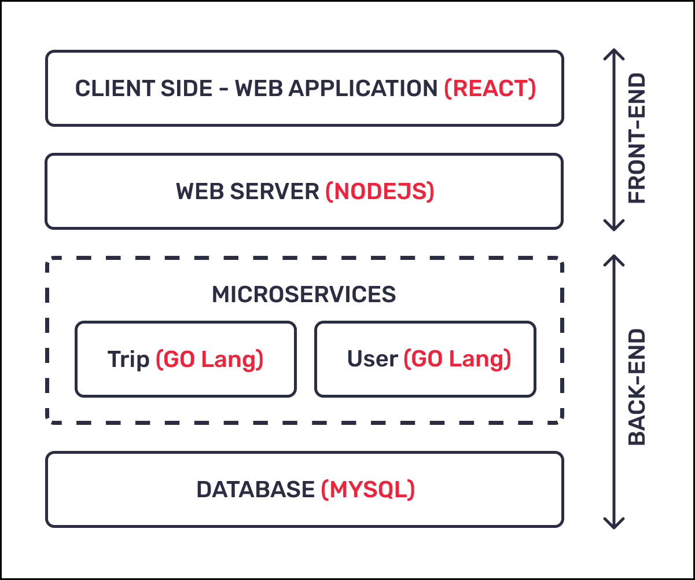

# ETI ASG1 DOCUMENTATION :page_facing_up:

## Design Considerations

#### Brief Description

The car-pooling platform is ingeniously designed with a microservices architecture, where each microservice fulfills specific business functions. This system thrives on seamless interactions facilitated by interconnected APIs, optimizing data management by maintaining dedicated databases for each microservice. At the forefront stands a React-based web application, delivering an engaging user interface. A Node.js web server intelligently routes requests to specific microservices, initiating a choreographed exchange of information. Key components include two pivotal Go Lang-powered microservices. The Trip Microservice expertly manages trip-related operations, while the User Microservice oversees user-centric tasks. Deepening the platform's integrity is MySQL as the relational database management system. The distinct databases exemplify the architecture's commitment to scalability and modularity. Orchestrated collaboration creates a fluid and scalable system, enhancing fault isolation and adaptability. Restful APIs seamlessly connect frontend and backend components, epitomizing the commitment to a seamless and scalable car-pooling experience.

#### Assumptions

1. Form Validation:
    - No form validation checks are implemented, assuming users enter correct values. This assumes users are responsible for input accuracy.
    - Users are expected to adhere to their designated roles. For instance, non-Car Owners should refrain from filling in fields specifically designated for Car Owners, promoting accurate data entry and streamlined form submissions.

2. Passenger Trip Cancellation:
    - Passengers are restricted from canceling trips, while Car Owners retain the ability to cancel. This assumption simplifies trip management and ownership.

3. Destination-Only Search:
    - The search function is limited to destination addresses. This acknowledges the common scenario where passengers primarily search based on their intended end destination.

4. Trip Start Status:
    - If a trip does not commence by the specified start date and time, it is assumed to be automatically canceled. Backend systems do not actively manage this status, relying on the start time for inference.

5. Car Owner Trip Actions Window:
    - Car Owners can only initiate or cancel trips within a 30-minute window before the designated start date and time. This assumption places a time constraint on trip actions for scheduling predictability.

6. Scheduled Trips Suitability:
    - Car Owners are expected to publish trips aligning with their schedules, considering both start and end datetimes. It is assumed that overpublishing or conflicts related to datetime mismatches will not occur due to responsible scheduling.

7. Single Passenger Trip Booking:
    - Passengers are restricted from booking the same trip more than once. This assumption simplifies trip management and avoids complexities associated with multiple bookings for the same journey.


## Architecture Diagram



1. Client Side - Web Application (React):
    - Description: The front-end of the car-pooling platform is built using React, a popular JavaScript library for building user interfaces.
    - Purpose: The React application provides a responsive and interactive user interface for users to interact with the car-pooling platform. It allows users to view available trips, search for rides, book trips, and manage their profile.
2. Web Server (Node.js):
    - Description: The web server, implemented using Node.js, acts as an intermediary between the client-side React application and the back-end microservices.
    - Purpose: It handles incoming HTTP requests from the React application, processes them, and communicates with the appropriate microservices to fetch or store data. Node.js is known for its non-blocking, event-driven architecture, making it suitable for handling a large number of concurrent requests.
3. Microservices:
    - Description: The core functionality of the car-pooling platform is divided into microservices, each responsible for specific tasks.
    - Purpose:
        - 3a. Trip Microservice (Go Lang):<br/>
            - Manages data related to carpool trips, including trip details, availability, and booking information.
            - Handles CRUD (Create, Read, Update, Delete) operations for trips.
            - Ensures that trip-related business logic is encapsulated within this microservice.
        - 3b. User Microservice (Go Lang):
            - Manages user-related data, including user profiles, authentication, and authorization.
            - Handles user registration, login, and profile management.
            - Ensures that user-related business logic is encapsulated within this microservice.
4. Database (MySQL):
    - Description: MySQL is used as the relational database management system (RDBMS) to store structured data.
    - Purpose: Stores persistent data related to trips, users, bookings, and other relevant information.


Overall Flow:
- User Interaction: Users interact with the React-based web application, making requests for various actions such as viewing trips, booking rides, and managing their profile.
- Web Server Processing: The Node.js web server receives incoming requests, processes them, and communicates with the relevant microservices.
- Microservices Handling: The Trip Microservice manages trip-related data and logic, while the User Microservice handles user-related functionalities.
- Database Interaction: Both microservices interact with the MySQL database to fetch and store data, ensuring data consistency and persistence.
- Response to User: The processed data is sent back to the React application through the web server, providing real-time updates and responses to user actions.


Key Benefits of Microservices Architecture:
- Scalability: Each microservice can be independently scaled based on its demand.
- Modularity: Microservices allow for independent development, deployment, and maintenance of different components.
- Fault Isolation: Failures in one microservice do not necessarily impact the entire system.


## Setting Up and Running Microservices

Follow these steps to set up and run the microservices locally:

#### Prerequisites

- Ensure you have Docker and Docker Compose installed on your machine.
- Install any necessary dependencies for each microservice.

#### Steps

1. Frontend:
    - Clone the repository
    ```
    git clone https://github.com/Ryanyzh/ETI_ASG1.git
    ```
    - Install the dependencies
    ```
    cd codes/frontend/eti-asg1-frontend
    ```
    ```
    npm install
    ```
    - Run the program
    ```
    npm run start
    ```

    

2. Backend:
    - Clone the repository for Trip
    ```
    git clone https://github.com/Ryanyzh/ETI_ASG1.git
    ```
    - Switch into into the directory for Trip
    ```
    cd codes/backend/trip
    ```
    - Install the git dependencies
    ```
    go mod init trip
    ```
    ```
    go get github.com/gorilla/mux
    ```
    ```
    go get "github.com/go-sql-driver/mysql"
    ```
    ```
    go get github.com/rs/cors
    ```
    - Run the Trip program
    ```
    go run trip.go
    ```
    - Clone the repository for User
    ```
    git clone https://github.com/Ryanyzh/ETI_ASG1.git
    ```
    - Switch into into the directory for User
    ```
    cd codes/backend/user
    ```
    - Install the git dependencies
    ```
    go mod init user
    ```
    ```
    go get github.com/gorilla/mux
    ```
    ```
    go get "github.com/go-sql-driver/mysql"
    ```
    ```
    go get github.com/rs/cors
    ```
    - Run the Trip program
    ```
    go run user.go
    ```

3. Database:

    - Frontend: [Listening on port 3000](http://localhost:3000)
    - Trip Backend: Listening on port 5001
    - User Backend: Listening on port 5000
    - MySQL Database: Listening on port 3306


4. To stop the services, use:

    ```
    Windows: CTRL + C
    ```
    ```
    Select Y (for yes) in the frontend application
    ```


## Contributors

- Yong Zong Han Ryan (S10219317A)

## Useful Links

- This project is licensed under the [MIT License](LICENSE).
